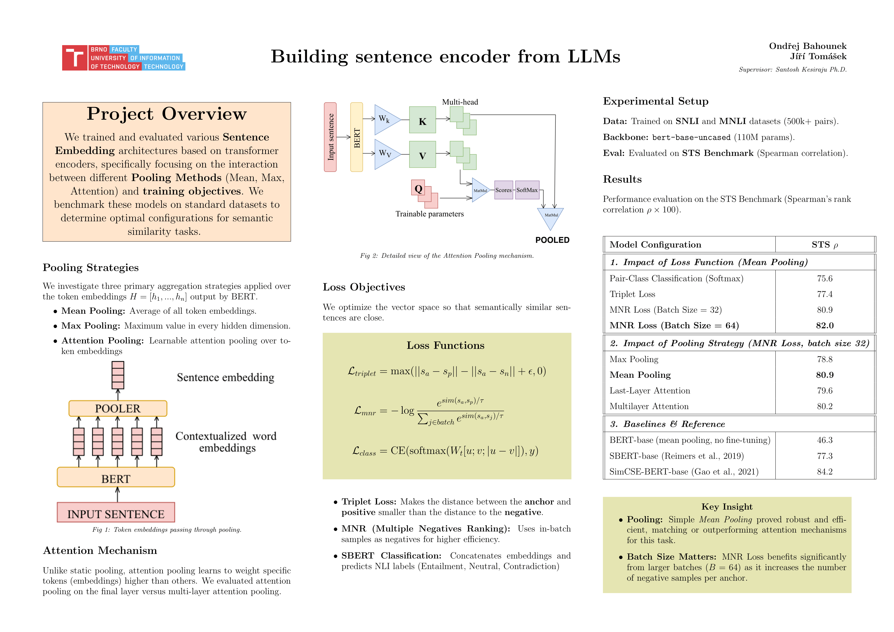

# Building Sentence Encoders from Large Language Models

This project explores how a pretrained **BERT-base** transformer can be fine-tuned into a **sentence encoder** for generating meaningful sentence embeddings. We compare different **pooling strategies** (mean, max, and attention-based pooling) and **training objectives** (Triplet Loss, Multiple Negatives Ranking Loss, and SBERT-style classification) using the SNLI and MNLI datasets. The resulting sentence encoders are evaluated on the **STS Benchmark** using Spearman correlation to study their performance on semantic similarity tasks.

**Report:** [Project Report](ZPJa_report.pdf)

